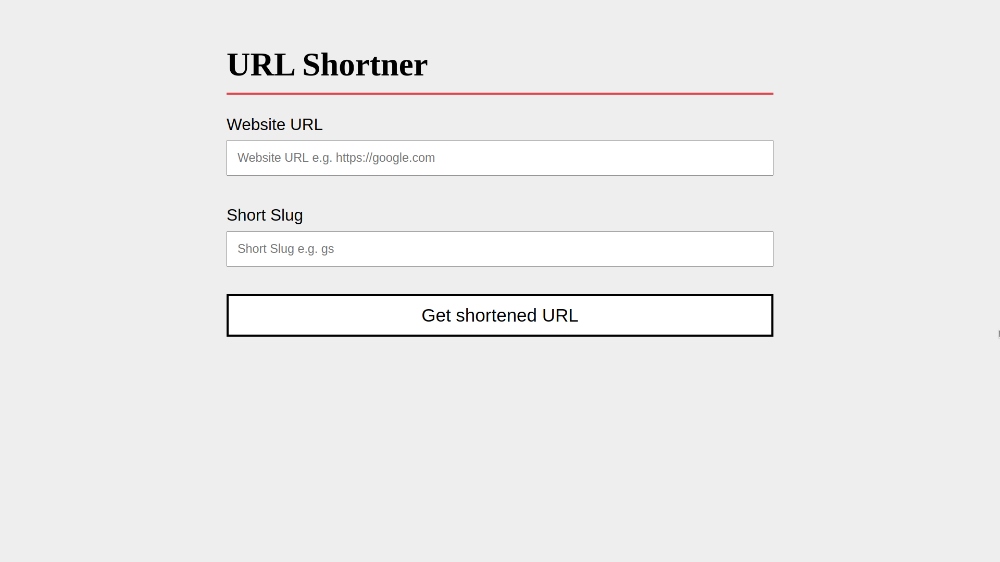
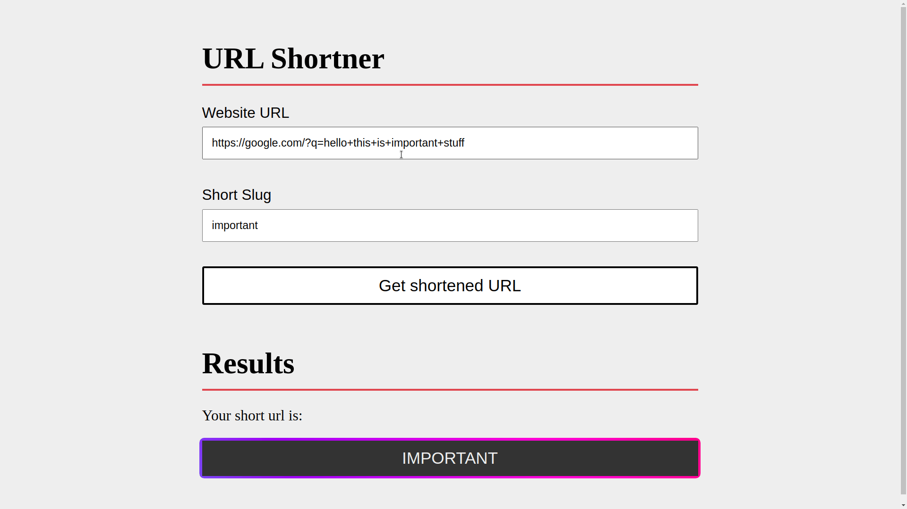
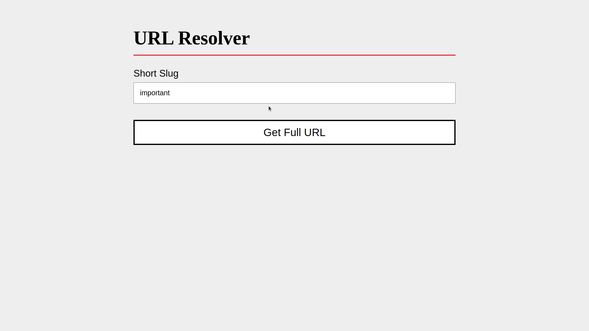
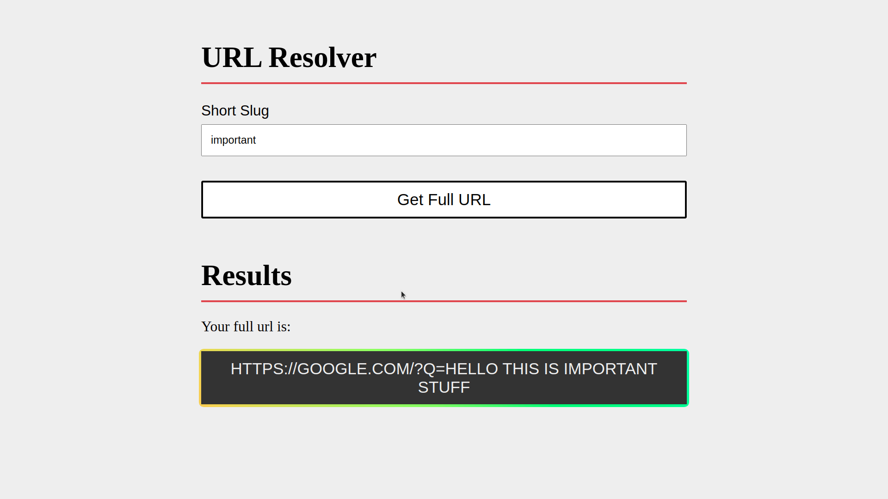

# URL Shortner

## Routes

| Route                                       | Description               |
| ------------------------------------------- | ------------------------- |
| Get /                                       | Returns static index page |
| Get /shorten/?url=base_url&slug=custom_slug | Returns the shortened url |
| Get /resolve/custom_slug                    | Returns the original url  |

## Sample Response:

200 OK!

```js
{
    base_url: "https://google.com",
    slug: "google"
}
```

400 BAD REQUEST ERROR!

```js
{
    message: "Slug already in use!",
}
```

# Setup Instructions

```sh
git clone https://github.com/devjayantmalik/url-shortner.git
```

```sh
cd url-shortner && npm install
```

```sh
npm start
```

## Screenshots





