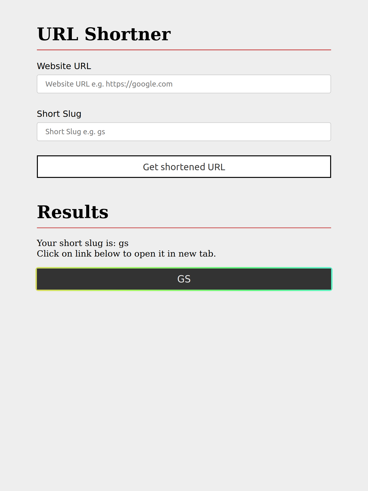

# URL Shortner

## Setup Instructions

```sh
git clone https://github.com/devjayantmalik/url-shortner.git
```

```sh
cd url-shortner && npm install
```

```sh
npm start
```

## Screenshots





## Usage

You can distribute or modify this code any way you like. Thanks, You are fully independent to do whatever you want to do with source code of this repository.

Believe me it's all yours, only on one condition. I will not take any responsibility if you do something illegal.

And of course if you are using this code for legal purposes, than it's ok!. Thanks.
